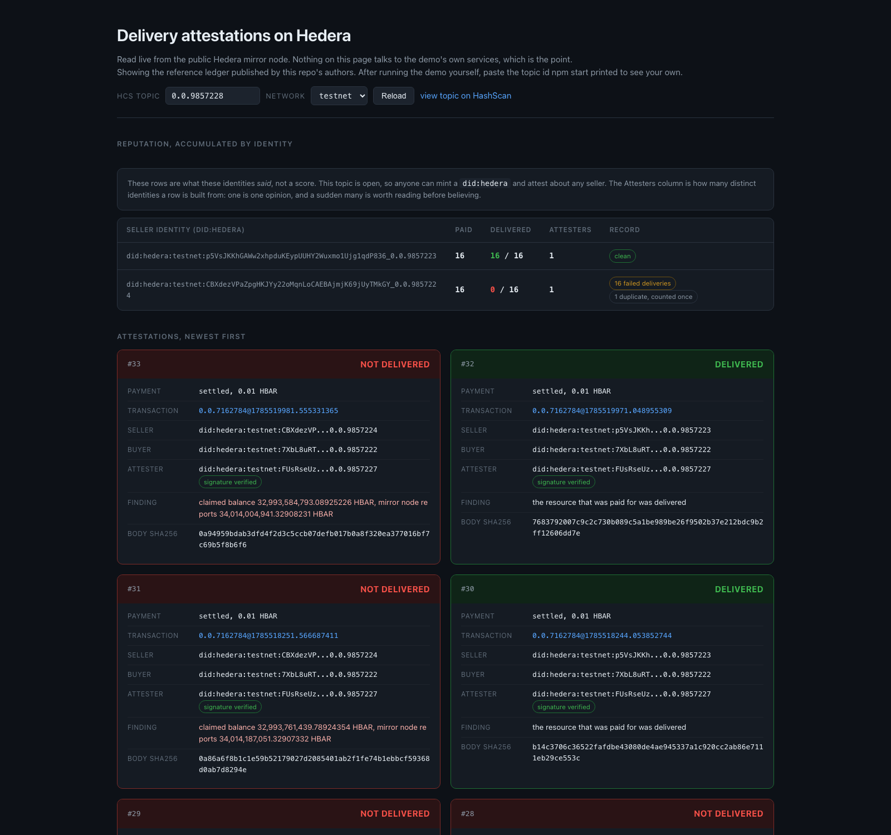
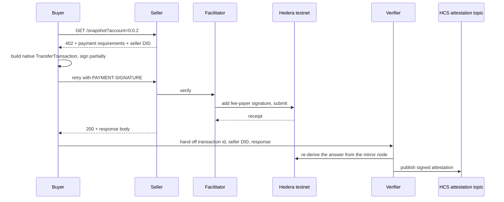

<div align="center">

# Delivery attestation for x402 on Hedera

**Payment is not proof of delivery.**

An agent buys a **Hedera account snapshot** from a paid API over x402 on testnet, and
whether the seller *actually delivered* it is written to Hedera Consensus Service as a
signed attestation.

The thing being sold is deliberately something you can check yourself, so every claim
below is falsifiable rather than asserted.

[](https://github.com/EnvisionBlockchain/x402-hedera-delivery-attestation/actions/workflows/ci.yml)


Built by [Envision Blockchain](https://envisionblockchain.com) for the Hedera x402 bounty.

</div>

---

## The result, in ten seconds

One command buys the same account snapshot from two sellers. Both payments settle
on Hedera. Only one seller delivers what was bought.

|                                 | Honest seller      | Dishonest seller   |
| :------------------------------ | :----------------: | :----------------: |
| Payment settled on chain        |      **YES**       |      **YES**       |
| Amount                          |    0.01 HBAR       |    0.01 HBAR       |
| HTTP status                     |      **200**       |      **200**       |
| Response is well formed         |      **YES**       |      **YES**       |
| `did:hedera` identity resolves  |      **YES**       |      **YES**       |
| Snapshot timestamp genuine      |      **YES**       |      **YES**       |
| **Resource actually delivered** |    ✅ **YES**      |     ❌ **NO**      |

Everything above the final row is identical. Nothing available *before* paying
separates them. Only the attestation layer can.

### Watch it (4:51)

[**docs/media/demo-video.mp4**](docs/media/demo-video.mp4) walks the thesis, the
code, a live run, how an agent buys through the skill, and independent
verification. Built reproducibly from
[`scripts/video/segments.mjs`](scripts/video/segments.mjs); the written script at
[`docs/DEMO_SCRIPT.md`](docs/DEMO_SCRIPT.md) is generated from the same source so
the two cannot disagree.

> [!NOTE]
> Every visual in that video is real: both terminal segments are genuine asciinema
> captures (`npm start` and the skill's own `npm run buy`, slowed to fit the
> narration), and the code panels are excerpts read off disk at build time. The
> **narration is synthesised** (Higgsfield text-to-speech) over a generated score.
> `docs/DEMO_SCRIPT.md` carries the full script and the command to remux a human
> read over the same cut.

<p align="center">
  
</p>

<p align="center"><sub>A real <code>npm start</code> run, captured with asciinema. Every transaction id above is live on HashScan.</sub></p>

### Verify it yourself, on chain

| What | Link |
| :--- | :--- |
| Honest payment | [`0.0.7162784@1785519971.048955309`](https://hashscan.io/testnet/transaction/0.0.7162784@1785519971.048955309) |
| Dishonest payment | [`0.0.7162784@1785519981.555331365`](https://hashscan.io/testnet/transaction/0.0.7162784@1785519981.555331365) |
| Attestation topic | [`0.0.9857228`](https://hashscan.io/testnet/topic/0.0.9857228) &nbsp;·&nbsp; seq **#32** delivered, **#33** not delivered |
| Seller identity | [`did:hedera:testnet:p5VsJKKh...qdP836_0.0.9857223`](https://hashscan.io/testnet/topic/0.0.9857223) &nbsp;·&nbsp; resolvable with any `did:hedera` resolver |

Both are `CRYPTOTRANSFER`, result `SUCCESS`. That is the point.

The complete transfer list of the honest payment, which sums to zero and
reconciles directly against HashScan:

```text
0.0.9929      -0.01000000 HBAR   buyer pays the price
0.0.9857218   +0.01000000 HBAR   seller receives it
0.0.7162784   -0.00296771 HBAR   facilitator sponsors the network fee
0.0.802       +0.00296771 HBAR   fee collector receives it
```

**The buyer never pays gas.** That is Hedera's own `exact` scheme, not a generic
EVM workaround.

---

## Why this matters

### First, what is actually being bought

An agent buys a **snapshot of a Hedera account**: its balance, its token count,
and the moment in time those were true. It buys rather than fetches because it
needs the state of an account it does not run and does not want to run the
infrastructure to watch. A paid data API, of the kind an agent economy will buy
constantly. Nothing exotic.

That resource was chosen for one reason: **you can check it yourself**. The
mirror node is public, so every claim this demo makes about a delivery is
falsifiable by a stranger with `curl`, and the verifier's judgement can be
audited rather than believed. A demo that sold an LLM completion or a
proprietary feed would prove nothing, because you would have to take our word
that the check was real.

That is also the honest answer to the obvious objection. Yes, you could look
this particular number up for free. **In production you buy the answers you
cannot look up**, and that is precisely when a delivery attestation is the only
thing standing between an agent and a seller's word. The mechanism is what
generalises; the resource is what makes the mechanism checkable in front of you.

### Then, the gap

Payment is not trust, and identity is not trust either.

You can verify who an agent is, confirm the advertised price was honest, and
watch the payment settle irreversibly on chain, and the buyer can still receive
nothing of value. **Settlement landing and the resource arriving are different
events**, and only the second one is what the buyer paid for.

Every pre-payment signal above is clean for *both* sellers. The dishonest one
fakes as little as it possibly can:

| It tells the truth about | It lies about |
| :--- | :--- |
| The account that was requested | The balance |
| The snapshot timestamp, fetched live from the mirror node | The token count |
| The response schema | |
| Its own `did:hedera` identity | |

A shape check passes that response. Only re-deriving the answer from an
independent source catches it, and writing that verdict somewhere permanent is
what turns a caught lie into reputation.

### Reputation is why the attestation names a DID, not a URL

An attestation about `http://localhost:4021/snapshot` is worthless, because a bad
seller simply moves. An attestation about
`did:hedera:testnet:p5VsJKKh…_0.0.9857223` accumulates against an identity that
cannot be shed by re-registering an endpoint.

Run the demo repeatedly and the ledger separates cleanly: a perfect record for
the honest seller, a perfectly bad one for the mock, every payment succeeding
throughout. Reputation only accumulates because the identities persist across
runs: `npm start` provisions once and reuses what it wrote to `.env`. Pass
`--reprovision` for a fresh set, which is what a new seller would be, and the
old record stays behind with the old identity.

<p align="center">
  
</p>

<p align="center"><sub><code>viewer/index.html</code> reading the live attestation topic. One static file, no server, no build step, and it depends on nothing this repo runs. This is topic <code>0.0.9857228</code>, our own ledger after sixteen runs, plus one deliberately replayed entry; every clone provisions its own topic and starts empty.</sub></p>

An attestation per delivery is viable because an HCS message costs a **fixed,
predictable** fee. Measured across all 33 messages on this topic, each cost
**0.01013 to 0.01076 HBAR** to publish: a nine-hundred-byte message, so above
Hedera's $0.0001 base rate for a minimal one, and still a flat fee that does not
move with network load. The predictability is the load-bearing part. On a rail
where the fee floats, the cost of attesting is unknowable at the moment you
decide whether attesting is worth it.

Being honest about the ratio: this demo's `PRICE_HBAR` default is 0.01 HBAR, so
here an attestation costs marginally *more* than the delivery it describes. That
is an artefact of pricing a demo resource at a round number near the floor, not a
property of the design. Attestation makes sense per-delivery above roughly a cent,
or batched below it.

---

## Quickstart

You need **one** funded Hedera testnet account, free from
[portal.hedera.com](https://portal.hedera.com/).

> [!TIP]
> **Prefer the ED25519 key.** The portal issues both, and both settle x402
> payments on Hedera; each has been run end to end here. ED25519 is worth
> preferring because a `did:hedera` root key must be Ed25519, so an ED25519
> account carries **one key** for both its identity and its payments. With an
> ECDSA account the buyer needs a second, identity-only key, which `npm start`
> generates and tells you about.

```bash
npm ci
HEDERA_ACCOUNT_ID=0.0.xxxxx HEDERA_PRIVATE_KEY=302e... npm start
```

> [!NOTE]
> Nothing signs until the key is checked against the ledger, so a wrong key
> fails in seconds with an explanation rather than as `INVALID_SIGNATURE` mid
> demo. One case is worth knowing about: if an account's key has been rotated,
> the portal has been seen still displaying the **original** key, so the value
> you copy is genuinely the one on the card and genuinely will not work. The
> preflight detects that specific case by comparing against the account's alias
> and says so. Reset the key on that account, or use another one.

That is the whole setup. No file to edit. `npm start` provisions the other three
accounts, issues four `did:hedera` identities, creates the attestation topic,
writes all of it to `.env`, then runs the full demo. It is idempotent, so a second
run reuses what exists. Pass `--reprovision` to force a fresh set.

Then see the ledger it just wrote:

```bash
npm run attestations   # read the verdicts back in the terminal, checking every signature
npm run viewer         # the same ledger as a page, in your browser
```

| Command | Does |
| :--- | :--- |
| `npm start` | Provision if needed, then run the whole demo |
| `npm run attestations -- --last 2` | Read the verdicts back, verifying every signature |
| `npm run viewer` | Open your reputation ledger in a browser, live from the mirror node. Reads your topic from `.env`; pass one to look at somebody else's: `npm run viewer -- 0.0.9857228` |
| `npm run smoke` | One paid call and nothing else |
| `npm run buy -- --url <endpoint> [--verify]` | Buy from any x402 Hedera endpoint. `MAX_SPEND_HBAR` is the only limit on what that endpoint can charge, and a requirement priced in anything but HBAR is refused outright since the cap could not bound it. `--verify` only reaches a delivery verdict for this demo's snapshot resource, since that is the one the verifier has an independent oracle for; against anything else it prints NOT DELIVERED, meaning delivery could not be established rather than that the seller cheated |
| `npm test` | Unit suite. No credentials and no Hedera keys. It binds loopback ports to exercise the seller gate, and those gate tests do reach the facilitator to build a 402, so it is not fully offline |
| `npx tsx scripts/check-account.ts` | Confirm a key controls its account before spending |
| `npm run netcheck` | Confirm the network, mirror node, and facilitator agree. Signs nothing |

Provisioning spends **about 7.2 testnet HBAR**, measured on chain rather than
estimated: 3 HBAR of starting balance for the three accounts it creates, about
2.2 HBAR in account-creation fees, and the rest in fees for five HCS topics and
the DID create messages. Afterwards the sellers spend nothing at all and the
verifier spends 0.01013 to 0.01076 HBAR per attestation. A run publishes two, so
1 HBAR of starting balance is roughly **fifty runs**, which the verifier account
bears out: funded with 1 HBAR, it holds 0.667 after sixteen.

Prefer a file? `cp .env.example .env` and fill in the same two values there.

### Choosing a network

`HEDERA_NETWORK` selects the network. It takes `testnet` or `mainnet` and
nothing else: an unrecognised value is refused rather than defaulted, so a typo
can never quietly pick a network on your behalf.

```bash
HEDERA_NETWORK=testnet npm start   # default
HEDERA_NETWORK=mainnet npm start   # real HBAR
```

`npm run netcheck` prints everything the network selection controls and proves
each piece is reachable, without signing anything. Run it after switching.

Everything published in this repo, including the transactions linked above and
the demo video, was produced on **testnet**. Mainnet is supported, not
demonstrated.

Selecting mainnet changes four things, all of them automatically:

| | testnet | mainnet |
| :--- | :--- | :--- |
| Mirror node and HashScan links | testnet | mainnet |
| x402 network identifier | `hedera:testnet` | `hedera:mainnet` |
| Default facilitator | `api.testnet.blocky402.com` | `api.blocky402.com` |
| Default `MAX_SPEND_HBAR` | `0.1` | `0.01` |

> [!WARNING]
> On mainnet every transfer costs real HBAR, and bootstrap's ~7.2 HBAR of
> provisioning is real money rather than faucet money. The dishonest seller is
> a deliberate mock that takes payment and returns fabricated values; on
> mainnet it takes **real** payment. It pays back to an account you control, so
> the money round-trips minus network fees, but run it knowing that.
>
> The buyer refuses to sign above `MAX_SPEND_HBAR` and every entry point prints
> the network before it does anything. Those are the guards. There is no
> undo on a settled transfer.

A `did:hedera` identity carries its network in the identifier itself, so a
testnet DID and a mainnet DID for the same key are different identities and
neither resolves on the other's mirror node. Reputation does not cross networks,
which is correct: a track record earned with faucet money is not a track record.

`viewer/index.html` has no environment to read, so it carries a network
selector instead. Links are shareable as
`viewer/index.html?topic=0.0.x&network=mainnet`.

---

## How it works



Four roles, separated in code, sharing one process in this demo. The buyer pays
but never judges. The verifier judges but never pays. The seller is asked for
nothing it could lie about without being caught.

Before reaching a verdict, the verifier establishes two things **without asking
the seller for anything**:

1. **The advertised identity controls the account that was paid.** Not because
   the DID Document says so. The DID's root key and the account's key are the
   same key, and the verifier reads that key from the **ledger's** own record of
   the account. So a seller cannot advertise a reputable identity while taking
   payment to an unrelated account, and it cannot fix that by publishing a
   document claiming otherwise.
2. **The returned values match reality.** The verifier queries the Hedera mirror
   node itself and compares.

### Hedera does two distinct jobs here

| Hedera capability | Used for |
| :--- | :--- |
| `exact` scheme, native `TransferTransaction` | Payment, with the facilitator as fee payer so the buyer never pays gas |
| Consensus Service | Four `did:hedera` identities, one topic each |
| Consensus Service | The shared delivery attestation topic |
| Mirror node | Independent re-derivation, DID resolution, payment confirmation |

That HCS carries both identity *and* attestation is what makes this specific to
Hedera rather than a generic chain integration.

---

## Which settlement path, and why

The obvious approach is x402's `exact` scheme over Hedera's EVM layer with USDC
via EIP-3009 `transferWithAuthorization`. **That does not apply here.** Hedera's
USDC is an HTS token and does not expose the EIP-3009 authorization entry point
exact-EVM expects.

Hedera has its own registered `exact` scheme instead, and it is a better fit than
the EVM path would have been. The buyer builds a **native Hedera
`TransferTransaction`**, signs it, and deliberately leaves it incomplete. The
facilitator adds its signature as fee payer and submits it.

| Decision | Why |
| :--- | :--- |
| [`@x402/hedera`](https://www.npmjs.com/package/@x402/hedera) against the open [blocky402](https://blocky402.com) facilitator | Official packages, real third-party facilitator, no API key |
| **HBAR, not USDC** | HTS tokens need explicit association before an account can receive them. That is an extra step for both parties and the likeliest place someone cloning this fails. The bounty permits HBAR |
| **`did:hedera` through the official [Hiero DID SDK](https://github.com/hiero-ledger/hiero-did-sdk-js)** | A hand-rolled method that no other resolver can read is worse than no method at all. The published package does not load; the fix from its own open pull request is applied here through `patch-package`. See [docs/DID.md](docs/DID.md) |

Nothing here is bound to that facilitator. `FACILITATOR_URL` points at any x402
facilitator serving your network, and `npm run netcheck` verifies the one you
chose actually settles on it before anything signs.

---

## What is real, and what is not

This is a credibility artifact, so the boundaries are explicit.

**Real.** Every payment, on Hedera testnet, through the x402 `exact` scheme via a
third-party facilitator. Every DID, anchored to its own HCS topic and resolvable
through the public mirror node. Every attestation, signed and published to HCS.
Every delivery verdict, derived from mirror node data the verifier fetched itself.

**A deliberate mock.** The dishonest seller in `src/seller/dishonest.ts`. It is not
a real service and represents no real operator. It exists to be caught, and says
so in its own source header, at startup, in this README, and in [NOTICE](NOTICE).

**Simplified, and stated rather than hidden.**

- The buyer hands the response to the verifier in-process. In production the
  verifier would be an independent party observing the exchange, not a function
  call away.
- **All four parties are one operator here.** `npm run bootstrap` generates the
  seller, the mock seller, and the verifier, funds them from the buyer's
  account, and writes all four private keys to your local `.env`. In reality
  each of these is a separate business that arrives already holding its own
  account from its own wallet, and onboards itself. One machine simulating four
  parties cannot avoid holding four keys; that is a property of the demo, not a
  claim about the design.
- **The DIDs are not custodial in the sense that matters, but the topics are.**
  A `did:hedera` identifier *is* its owner's public key, and the create event on
  its topic is signed by that party's own key. So an identity cannot be minted
  for someone whose key you do not hold, the operator cannot sign as a seller it
  provisioned, and the self-certification check both the viewer and the CLI
  perform would catch it if it tried. What the operator *does* hold, because the
  SDK sets it, is the admin and submit key of each DID topic. It cannot forge an
  identity with that; it can restrict who writes to the topic that identity is
  published on. See the note on submit keys below.
- **The identity binding proves who was *paid*, not who *served*.** This is the
  most precise thing the verifier establishes, and the wording elsewhere is
  looser than it should be. What is checked is that the advertised DID's root
  key is the key the ledger records for the account that received the money.
  Nothing checks that the same party is the one that returned the bytes: the
  response arrives over plain HTTP from whatever host the URL resolved to, and
  it carries no signature. So "seller X delivered" is shorthand. The claim with
  its edges on is: *the account paid belongs to X, and the response that came
  back was, or was not, the resource that was bought.* A host that could
  intercept the response could make an honest seller look dishonest, and the
  attestation would name X either way. Signing the response body under the
  seller's DID key would close it, and is not built.
- **The runtime already accepts independently-created accounts.** Each party's
  credentials are read from environment variables, so four accounts you
  provisioned yourself work exactly as well as four the operator minted. What is
  missing is the onboarding path: `bootstrap` always generates rather than
  reusing accounts you supply, so using your own today means provisioning their
  DIDs yourself. Making bootstrap adopt supplied accounts, and giving the buyer
  skill a self-onboarding flow, is the honest next step and is not built.
- Attestations are signed JSON, not W3C Verifiable Credentials. The mapping is
  documented below rather than half-built.
- One resource type, one price, one attestation topic. This demonstrates a
  mechanism, not a product.
- **The freshness bound is half an hour, not real time.** Delivery requires the
  snapshot to be under 1800 seconds old. That is neither arbitrary nor tight:
  measured snapshot cadence on testnet is 901 seconds, and a balance query returns
  the most recent snapshot at or before the requested time, so an honest seller
  asking for "now" legitimately receives one nearly a full interval old. Two
  intervals is the smallest bound that does not fail honest sellers. So this proves
  the data is recent, not current.
- **The DID topics carry the operator's submit key, and we did not choose that.**
  `@hiero-did-sdk` sets the admin and submit keys of a DID topic to the
  publisher's key, so all four DID topics here are keyed to the operator account
  that paid for provisioning. Check it yourself:
  `curl -s https://testnet.mirrornode.hedera.com/api/v1/topics/0.0.9857223 | grep -o '"submit_key".*'`.
  Two honest consequences. Writes to those topics are restricted rather than
  open, which is stricter than this demo needs. And the operator, being the same
  party that runs everything else here, holds the write path to identities it
  provisioned for others, which is a real centralisation this demo has not
  escaped. **Resolution does not depend on either.** It is self-certifying rather
  than last-writer-wins: the identifier *is* the root key, so a document
  rebinding an established DID to someone else's key is inert no matter who
  publishes it, and the create event must verify under that same key. The
  attestation topic `0.0.9857228` genuinely carries no keys at all, which is the
  one that matters for the reputation argument.
- Testnet by default, and every result published here is testnet. Mainnet is
  supported but must be named explicitly; anything that is neither network is
  refused rather than defaulted. See [Choosing a network](#choosing-a-network).

**What the DID binding does and does not prove.** Each provisioned party's DID
root key *is* the key of the Hedera account it transacts with, and the verifier
confirms that against the mirror node rather than against a field in a document.
That proves identity and payee are the same entity, with no separate handshake
and nothing self-asserted. It proves **nothing** about who controls that identity
in the real world. There is no issuer, no registry, and no revocation here.

The buyer is the exception and is called out at provisioning time: if the
operator's portal account is ECDSA it cannot share a key with a `did:hedera`
identity, so the buyer gets a separate identity-only key. The buyer signs no
attestations, so nothing downstream rests on it.

---

## Beyond the MVP

The attestation record is deliberately one field-mapping away from a **W3C
Verifiable Credential**. The path, not built here:

- `attesterDid` becomes `issuer`; the delivery **event** becomes
  `credentialSubject`, keeping the subject the event rather than the seller, so a
  negative attestation is an observation rather than a character judgment.
- The signature becomes a Data Integrity `proof`. Use the `eddsa-jcs-2022`
  cryptosuite over RFC 8785 canonicalization rather than JSON-LD, which avoids
  needing a JSON-LD processor while staying conformant and keeping the message
  readable on HashScan. Watch the roughly 1KB HCS single-message threshold.
- Revocation and status lists, absent entirely today.
- **Multiple independent attesters** writing to the same topic, with quorum, so a
  single verifier is not a trusted third party.
- **Aggregation into reputation.** The real destination, and the reason the subject
  is a DID rather than a URL.

---

## Repository layout

<details>
<summary><b>Click to expand</b></summary>

```text
src/
  config.ts            env loading, network selection, spend cap
  hedera/
    client.ts          single-SDK-instance guard, chain-verified key resolution
    did.ts             did:hedera issuance and self-certifying resolution over HCS
    mirror.ts          mirror node reads, exact-precision safe
    units.ts           HBAR <-> tinybar conversion, the only unit boundary
  seller/
    gate.ts            the x402 payment gate, shared by both sellers
    honest.ts          returns what the mirror node says
    dishonest.ts       DELIBERATE MOCK: returns fabricated values
  buyer/
    pay.ts             402, partial-sign, retry, spend cap
    cli.ts             deterministic driver
  verifier/
    check.ts           pure delivery decision logic, fully unit tested
    verify.ts          identity binding, payment confirmation, re-derivation
    attest.ts          attestation building, signing, HCS publishing
  demo.ts              the two-act contrast
scripts/
  start.ts             the one command: provision if needed, then run
  bootstrap.ts         provisions accounts, DIDs, attestation topic
  smoke.ts             one paid call
  check-account.ts     credential preflight
  netcheck.ts          network, mirror node, and facilitator coherence
  read-attestations.ts third-party read and signature verification
viewer/
  index.html           static reader of the attestation topic, no server or build
skills/
  x402-hedera-buyer/   agent instructions wrapping the buyer CLI
AGENTS.md              portable entry point, loaded by Codex and similar
```

</details>

The skill is instructions over the CLI, not an autonomous agent. The content is
plain markdown and portable; only how an agent discovers it differs.

| Agent | Where it goes | How it loads |
| :--- | :--- | :--- |
| **Claude Code** | `.claude/skills/x402-hedera-buyer/SKILL.md` | On demand. The `description` in the frontmatter is what decides when to reach for it, so it costs nothing until a 402 shows up |
| **Codex**, and anything following the [`AGENTS.md`](https://agents.md) convention | [`AGENTS.md`](AGENTS.md), already in this repo | Automatically, as project context, whenever the agent works in this directory |
| **Anything else** | Paste `SKILL.md` into the system prompt or context | However that agent takes instructions |

`AGENTS.md` is deliberately short. It carries the rules that have to hold even
if nothing else is read (run from the repo root, never report HTTP 200 as
success, exit code 2 is a finding rather than a crash, never print a key, do
not raise the spend cap to force a payment through) and points at `SKILL.md`
for the buying workflow itself. One authoritative copy, so the two cannot
drift.

The YAML frontmatter is the only Claude-specific part. Codex ignores it
harmlessly, so the same file serves both.

<p align="center">
  
</p>

<p align="center"><sub>The skill's own description, then the command it tells an agent to run. A real paid call on testnet, ending in an independently re-derived verdict.</sub></p>

What the description does is the point: it tells an agent when to reach for
this, and never to treat an HTTP 200 as success on its own. The agent pays,
then re-derives the answer rather than trusting the response.

It wraps a local checkout rather than a hosted service, so its commands are
`npm run` scripts that only work from this repository's root. Installing it to
a global `~/.claude/skills/` and invoking it from an unrelated directory fails
with `npm error code ENOENT`, which is npm not finding `package.json` rather
than anything being misconfigured. The skill opens by checking the working
directory for that reason. Putting it in the project-local
`.claude/skills/` avoids the problem entirely.

---

## Threat model

What this defends against, and what it does not. Security policy and reporting:
[SECURITY.md](SECURITY.md).

### The attestation topic is open on purpose

`0.0.9857228` was created with **no submit key**, so anyone on Hedera can append
to it. It also has no admin key, which means a submit key can never be added:
that is permanent, and you can confirm it yourself.

```bash
curl -s https://testnet.mirrornode.hedera.com/api/v1/topics/0.0.9857228 \
  | grep -o '"admin_key":[^,]*'
```

This is a deliberate choice rather than an oversight. Restricting writes would
make one party the gatekeeper of the ledger, which is the opposite of where
this is going: multiple independent attesters writing to the same topic, with
quorum, so that no single verifier has to be trusted.

**The defence is on read, not on write.** `viewer/index.html` checks every
signature against the root key of the attester's own DID, which is carried
inside the identifier itself. The key named inside a message is untrusted input,
used only to fail fast when it disagrees. A forged entry can be written, and it
will be shown, marked as not valid, and excluded from the reputation counts.
`npm run attestations` performs the same verification from the CLI.

Entries that fail are displayed rather than hidden, because hiding them would
conceal exactly the attack this is defending against.

**A forgery is not the only way to attack a count.** A *genuine* attestation,
copied and appended a second time, verifies perfectly: the signature is real. If
the reader tallied it twice, anyone could move a seller's record without forging
anything. So both readers count one verdict per payment **per attester**.

The attester belongs in that key, and leaving it out turns the defence into a
weapon. Anyone can mint a `did:hedera` and sign a verdict about somebody else's
payment. The topic reads oldest first, so a self-issued "delivered" would land
ahead of the real verifier's "not delivered" and the genuine verdict would be
discarded as a duplicate. Keyed per attester, two attesters disagreeing about
one payment are two observations, which is a thing to show rather than silently
collapse.

**That trade is not free, and this is the honest statement of it.** Closing
suppression opens its mirror image: twenty-five minted identities contribute
twenty-five counted rows about one payment, every signature genuine. Counting
cannot close both, because *whose word counts* is not answerable from an open
topic, and pretending otherwise would be the dishonest version of this README.
So the table reports **how many distinct attesters** each row is built from. One
attester is one opinion. A sudden twenty-five is worth reading before believing.
Filtering to a chosen set of attesters, or requiring a quorum, is the real
answer and is described under [Beyond the MVP](#beyond-the-mvp); it is not
built.

That is not a claim you have to take on trust. Sequence **#29** on this topic is
a verbatim replay of **#28**, which we appended deliberately. Both are shown,
both verify, and neither seller's record moves:

```text
32 verified attestation(s): 16 delivered, 16 not delivered.
1 message(s) re-attested a payment already counted above, and were counted once.
```

### What verification does and does not establish

| Established | Not established |
| :--- | :--- |
| The attestation was issued by the DID it names | That the attester's judgement was correct |
| The record has not been altered since signing | That the seller is trustworthy in general |
| The payment settled, and credited the seller the advertised price, both re-read from the ledger | That the seller will deliver next time |
| The seller's DID controls the account that was paid | That the same party served the response, which is unsigned |
| | Anything about sellers with no attestations |

A single verified attestation is one observation by one party. Reputation is
what accumulates across many, and that is why the subject is a DID rather than
a URL: an endpoint can be abandoned, an identity carries its record.

**The viewer does not filter who may attest.** Anyone can mint a `did:hedera`,
sign attestations naming any seller, and appear in the table as verified,
because the signature genuinely is theirs. Verification answers *who said
this*, not *whose word counts*. Deciding the second is the job of the
multi-attester quorum described under Beyond the MVP; until then, read the
table as "these identities said this", not as a score.

### The viewer verifies Ed25519 only

Signature checking in `viewer/index.html` uses Ed25519, which is what
`did:hedera` root keys are and what every party in this demo signs with. An
attester whose key was secp256k1 could not hold a conformant `did:hedera`
identity in the first place, so the page and `npm run attestations` agree on
every case that can arise here. Both would report such an attester as
unverified rather than pretending to check it.

### Network and funds

- **Testnet by default.** `HEDERA_NETWORK` accepts `testnet` or `mainnet` and
  refuses anything else rather than guessing, in either direction, so a typo
  cannot silently pick a network. Every published result here is testnet.
- **Mainnet spends real HBAR.** The default spend cap tightens tenfold there and
  every entry point prints the network before it does anything.
- **The spend cap is the only payment control.** `npm run buy -- --url` validates
  nothing about an endpoint and will sign a payment to whatever account it
  advertises. A requirement priced in anything but HBAR is refused outright,
  since a tinybar cap cannot bound a token amount; for HBAR,
  `MAX_SPEND_HBAR` is the limit on what an unknown endpoint can
  charge.
- **The demo servers bind to loopback**, so they are not reachable from other
  machines.
- **Keys live in a gitignored `.env`.** `npm run setup` prints public key
  material only.

### Dependencies

Two advisories resolved; five packages carrying fifteen advisories remain open
with no upstream fix, each assessed for
whether the vulnerable path is reachable here:
[docs/SECURITY_NOTES.md](docs/SECURITY_NOTES.md).

---

## Acknowledgements

This demo settles real payments on infrastructure other people built and run,
most of it available at no cost and without an API key. Named here because the
demo does not work without them.

**[Blocky402](https://blocky402.com)**, by
**[BlockyDevs](https://github.com/blockydevs)** ([blockydevs.com](https://www.blockydevs.com)).
The open x402 facilitator this demo pays through, on
[testnet](https://blocky402.com/docs/testnet/) and
[mainnet](https://blocky402.com/docs/networks/). It co-signs as fee payer and
submits the transfer, which is the piece that lets the buyer pay the price and
never the gas. Open access, no API key, no registration. Their
[docs](https://blocky402.com/docs/) are what the payment flow here was built
against, and the facilitator is self-hostable if you would rather not depend on
the hosted one.

**[x402 Foundation](https://x402.org)**, for
[`@x402/core`](https://www.npmjs.com/package/@x402/core) and
[`@x402/hedera`](https://www.npmjs.com/package/@x402/hedera), and for
registering a native Hedera `exact` scheme rather than making Hedera pretend to
be an EVM chain. Apache-2.0.

**[Hiero](https://hiero.org)**, for
[`@hiero-ledger/sdk`](https://www.npmjs.com/package/@hiero-ledger/sdk), the
maintained successor to the Hashgraph SDK, and for
[`hiero-did-sdk-js`](https://github.com/hiero-ledger/hiero-did-sdk-js), which
implements the registered `did:hedera` method so this demo did not have to
invent its own. Both Apache-2.0. The published DID packages currently do not
load ([#65](https://github.com/hiero-ledger/hiero-did-sdk-js/issues/65)); the
fix in [#66](https://github.com/hiero-ledger/hiero-did-sdk-js/pull/66), which
is somebody else's open contribution and not ours, is applied here with
`patch-package` and credited in [docs/DID.md](docs/DID.md).

**[Hedera](https://hedera.com)**, for the Consensus Service that makes
per-delivery attestation economically sensible at a fixed fee, the public
[mirror node](https://docs.hedera.com/hedera/sdks-and-apis/rest-api) that lets
the verifier re-derive the truth without trusting the seller, and
[HashScan](https://hashscan.io/) for making every claim in this README
independently checkable.

None of the above endorse this project or reviewed it. Any mistakes here are
ours.

---

## License

**Apache-2.0.** See [LICENSE](LICENSE) and [NOTICE](NOTICE).

Apache-2.0 rather than a shorter permissive licence for two reasons specific to
this artifact: it grants an express patent licence, where a licence silent on
patents does not, and it explicitly withholds trademark rights. It also matches the
ecosystem, since the x402 Foundation packages and every Hedera and Hiero SDK this
depends on are Apache-2.0.
